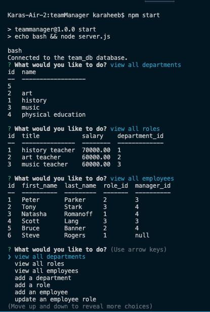

# teamManager

## Description
  This content management system is a command-line application built to manage a company's employee database. By using Node.js, Inquirer, and MySQL, business owners can easiy view and interact with information on departments, roles, and employees stored in databases in order to better organze and plan their business.

## Table of Contents
    * [Installation](#Installation)
    * [Usage](#Usage)
    * [License](#License)
    * [Demo](#Demo)
    * [Tests](#Tests)

## Installation
  Clone to repository to your local machine, and then create a .env file with your MySQL login information. Open the integrated terminal in the server.js file and run the command `npm i` to install dependencies. Run `mysql u root -p` and log in with your password to the shell in order to run the command `source schema.sql && source seeds.sql`. Run `quit` followed by `npm start` to view the inquirer prompts. Use arrow keys and the enter button to navigate through options, and enter answers directly within the terminal.

## Usage
  
  
## License
  MIT is the chosen license for this project.
  * https://opensource.org/licenses/MIT
  * 

## Demo
  Please follow this link to view demo video: (https://drive.google.com/file/d/1izol5RAxsOxHiv_Utpizj8pudioDXVxw/view)

## Tests
  Coming soon!

## Questions
  Check out my GitHub at https://github.com/kheeb
  Email me with any questions!
  karaheeb@gmail.com